# Execution Plan - 테이블오더 서비스

## Detailed Analysis Summary

### Change Impact Assessment
- **User-facing changes**: Yes — 고객용 주문 UI + 관리자 대시보드 신규 구축
- **Structural changes**: Yes — 전체 시스템 아키텍처 신규 설계 (프론트 2개 + 백엔드 + DB)
- **Data model changes**: Yes — 매장, 테이블, 메뉴, 주문, 세션 등 전체 스키마 설계 필요
- **API changes**: Yes — RESTful API 전체 신규 설계
- **NFR impact**: Yes — 동시 500명, SSE 실시간, 16시간 세션, 멀티테넌시

### Risk Assessment
- **Risk Level**: Medium
- **Rollback Complexity**: Easy (Greenfield — 기존 시스템 없음)
- **Testing Complexity**: Moderate (실시간 통신, 세션 관리, 멀티테넌시 테스트 필요)

---

## Workflow Visualization

```mermaid
flowchart TD
    Start(["User Request"])
    
    subgraph INCEPTION["🔵 INCEPTION PHASE"]
        WD["Workspace Detection<br/><b>COMPLETED</b>"]
        RA["Requirements Analysis<br/><b>COMPLETED</b>"]
        US["User Stories<br/><b>COMPLETED</b>"]
        WP["Workflow Planning<br/><b>IN PROGRESS</b>"]
        AD["Application Design<br/><b>EXECUTE</b>"]
        UG["Units Generation<br/><b>EXECUTE</b>"]
    end
    
    subgraph CONSTRUCTION["🟢 CONSTRUCTION PHASE"]
        FD["Functional Design<br/><b>EXECUTE</b>"]
        NFRA["NFR Requirements<br/><b>EXECUTE</b>"]
        NFRD["NFR Design<br/><b>EXECUTE</b>"]
        ID["Infrastructure Design<br/><b>EXECUTE</b>"]
        CG["Code Generation<br/><b>EXECUTE</b>"]
        BT["Build and Test<br/><b>EXECUTE</b>"]
    end
    
    Start --> WD
    WD --> RA
    RA --> US
    US --> WP
    WP --> AD
    AD --> UG
    UG --> FD
    FD --> NFRA
    NFRA --> NFRD
    NFRD --> ID
    ID --> CG
    CG --> BT
    BT --> End(["Complete"])

    style WD fill:#4CAF50,stroke:#1B5E20,stroke-width:3px,color:#fff
    style RA fill:#4CAF50,stroke:#1B5E20,stroke-width:3px,color:#fff
    style US fill:#4CAF50,stroke:#1B5E20,stroke-width:3px,color:#fff
    style WP fill:#4CAF50,stroke:#1B5E20,stroke-width:3px,color:#fff
    style AD fill:#FFA726,stroke:#E65100,stroke-width:3px,stroke-dasharray: 5 5,color:#000
    style UG fill:#FFA726,stroke:#E65100,stroke-width:3px,stroke-dasharray: 5 5,color:#000
    style FD fill:#FFA726,stroke:#E65100,stroke-width:3px,stroke-dasharray: 5 5,color:#000
    style NFRA fill:#FFA726,stroke:#E65100,stroke-width:3px,stroke-dasharray: 5 5,color:#000
    style NFRD fill:#FFA726,stroke:#E65100,stroke-width:3px,stroke-dasharray: 5 5,color:#000
    style ID fill:#FFA726,stroke:#E65100,stroke-width:3px,stroke-dasharray: 5 5,color:#000
    style CG fill:#4CAF50,stroke:#1B5E20,stroke-width:3px,color:#fff
    style BT fill:#4CAF50,stroke:#1B5E20,stroke-width:3px,color:#fff
    style Start fill:#CE93D8,stroke:#6A1B9A,stroke-width:3px,color:#000
    style End fill:#CE93D8,stroke:#6A1B9A,stroke-width:3px,color:#000
```



### Text Alternative
```
Phase 1: INCEPTION
  - Workspace Detection (COMPLETED)
  - Requirements Analysis (COMPLETED)
  - User Stories (COMPLETED)
  - Workflow Planning (IN PROGRESS)
  - Application Design (EXECUTE)
  - Units Generation (EXECUTE)

Phase 2: CONSTRUCTION (per-unit loop)
  - Functional Design (EXECUTE)
  - NFR Requirements (EXECUTE)
  - NFR Design (EXECUTE)
  - Infrastructure Design (EXECUTE)
  - Code Generation (EXECUTE)
  - Build and Test (EXECUTE)

Phase 3: OPERATIONS
  - Operations (PLACEHOLDER)
```

---

## Phases to Execute

### 🔵 INCEPTION PHASE
- [x] Workspace Detection (COMPLETED)
- [x] Requirements Analysis (COMPLETED)
- [x] User Stories (COMPLETED)
- [x] Workflow Planning (IN PROGRESS)
- [ ] Application Design - **EXECUTE**
  - **Rationale**: 신규 프로젝트로 컴포넌트 구조, 서비스 레이어, 비즈니스 규칙 설계 필요. 3개 프론트엔드/백엔드 모듈의 책임 분리와 API 계약 정의 필수.
- [ ] Units Generation - **EXECUTE**
  - **Rationale**: 복잡한 시스템(프론트 2개 + 백엔드 + DB)으로 작업 단위 분해 필요. 의존성 순서에 따른 구현 계획 수립.

### 🟢 CONSTRUCTION PHASE (per-unit)
- [ ] Functional Design - **EXECUTE**
  - **Rationale**: 데이터 모델(매장, 테이블, 메뉴, 주문, 세션), API 엔드포인트, 비즈니스 로직 상세 설계 필요.
- [ ] NFR Requirements - **EXECUTE**
  - **Rationale**: 동시 500명 지원, SSE 실시간 2초, 멀티테넌시, 16시간 세션 등 NFR 구현 전략 필요.
- [ ] NFR Design - **EXECUTE**
  - **Rationale**: NFR Requirements에서 도출된 패턴(커넥션 풀링, SSE 관리, 캐싱 등) 설계 필요.
- [ ] Infrastructure Design - **EXECUTE**
  - **Rationale**: AWS 배포 아키텍처(EC2, RDS, S3), 네트워크 구성, 스케일링 전략 설계 필요.
- [ ] Code Generation - **EXECUTE** (ALWAYS)
  - **Rationale**: 실제 코드 구현.
- [ ] Build and Test - **EXECUTE** (ALWAYS)
  - **Rationale**: 빌드, 테스트, 검증.

### 🟡 OPERATIONS PHASE
- [ ] Operations - **PLACEHOLDER**
  - **Rationale**: 향후 배포/모니터링 워크플로우 확장 예정.

---

## Skipped Stages
- **Reverse Engineering** — Greenfield 프로젝트, 기존 코드 없음

---

## Success Criteria
- **Primary Goal**: 테이블오더 MVP 플랫폼 완성 (고객 주문 + 관리자 모니터링 + 본사 매장 관리)
- **Key Deliverables**:
  - FastAPI 백엔드 (RESTful API + SSE)
  - React 고객용 웹앱 (태블릿 최적화)
  - React 관리자용 웹앱 (대시보드)
  - PostgreSQL 스키마
  - AWS 배포 설정
- **Quality Gates**:
  - 모든 유저 스토리의 Acceptance Criteria 충족
  - 동시 500명 부하 테스트 통과
  - SSE 2초 이내 주문 전달
  - 단위 테스트 커버리지 확보
